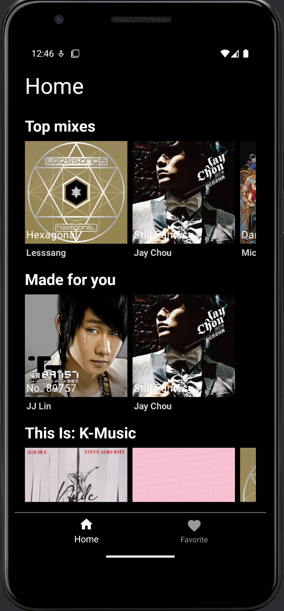

# MiniSpotifyPlayer

MiniSpotifyPlayer is an Android music player app built with Kotlin and Jetpack Compose. Users browse album sections on the home page, open an album to see its songs, play music from a mini player bar, and save favorite albums on the device.

The app follows the MVVM pattern with Hilt for dependency injection. Album and song data come from a Ktor backend in `server/`, which returns JSON from local files and serves the MP3 files. Favorites are stored in a Room database, and playback uses ExoPlayer.



## Features

- Home page with album sections, shown as horizontal rows of album covers
- Album page with a vinyl-style cover that rotates while music plays, and the song list
- Tap a song to stream it; the song that is playing is shown in green
- Mini player bar with play and pause, a seek bar, and a close button; playback continues across pages
- Favorite albums saved on the device and listed on the Favorite tab, which updates automatically
- Bottom navigation between Home and Favorite

## Tech Stack

| Area | Technology |
| --- | --- |
| App | Kotlin 1.7, Jetpack Compose, Material |
| Architecture | MVVM, StateFlow, Kotlin Coroutines and Flow, Hilt 2.44 |
| Navigation | Jetpack Navigation 2.5, Safe Args |
| Data | Retrofit 2.9 (Gson), Room 2.4, Coil |
| Playback | ExoPlayer 2.18 |
| Backend | Kotlin 1.8, Ktor 2.2 (Netty), kotlinx.serialization |

## Architecture

```
MainActivity (Hilt entry point)
  ├── NavHostFragment                   Home, Favorite, Playlist fragments (Compose screens)
  │     └── ViewModels (StateFlow)
  │           ├── HomeRepository, PlaylistRepository ── Retrofit ──→ Ktor server (:8080)
  │           └── FavoriteAlbumRepository ────────────────────────→ Room (Album table)
  └── PlayerBar (Compose) ── PlayerViewModel ── ExoPlayer ──→ /songs/*.mp3
```

Each screen collects a `StateFlow` from its ViewModel, and each ViewModel reads data through a repository. Hilt modules provide `Retrofit`, `NetworkApi`, `AppDatabase`, and `ExoPlayer` as singletons. `MainActivity` creates `PlayerViewModel`, and `PlaylistFragment` gets the same instance with `activityViewModels()`, so a song tapped on the album page also updates the player bar.

## Project Structure

Android paths are under `app/src/main/java/com/laioffer/minispotifyplayer/`.

| Path | Responsibility |
| --- | --- |
| `MainApplication.kt`, `MainActivity.kt` | Hilt application class; bottom navigation and the player bar. |
| `network/`, `database/` | Retrofit API and Room database, each with its Hilt module. |
| `datamodel/` | `Album`, `Section`, `Playlist`, and `Song` data classes. |
| `repository/` | Repositories for the home feed, playlists, and favorite albums. |
| `ui/home/`, `ui/playlist/`, `ui/favorite/` | Fragment, Compose screen, and ViewModel of each page. |
| `player/` | ExoPlayer Hilt module, `PlayerViewModel`, and `PlayerBar`. |
| `server/` | Ktor server: JSON data in `src/main/resources/`, song files in `static/songs/`. |

## API

| Method | Endpoint | Description |
| --- | --- | --- |
| GET | `/feed` | Album sections for the home page |
| GET | `/playlist/{id}` | Songs of one album |
| GET | `/songs/{file}` | MP3 file of a song |

## Run Locally

Requirements:

- Android Studio with an Android emulator (API 23 or later)
- A JDK to run Gradle; the server uses a JDK 11 toolchain, which Gradle downloads if needed

### Backend

Song files are not included in the repository. Put your MP3 files in `server/src/main/resources/static/songs/`, with the file names used in `playlists.json`.

```bash
cd server
./gradlew run
```

Open http://localhost:8080/feed to make sure that the server returns JSON.

### Android app

Open the project root in Android Studio, then run the `app` configuration on an emulator. The emulator reaches the backend on your computer through `10.0.2.2`.

## Configuration

| Name | Where | Description |
| --- | --- | --- |
| `BASE_URL` | `network/NetworkModule.kt` | Backend URL, default `http://10.0.2.2:8080/` |
| Cleartext domain | `app/src/main/res/xml/network_security_config.xml` | HTTP is allowed only for `10.0.2.2` |
| Song URLs | `server/src/main/resources/playlists.json` | Full URL of each MP3 file |

To use a physical device, change all three values to your computer's IP address.
